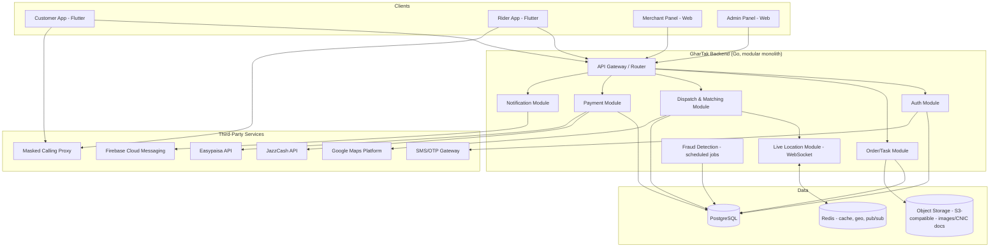

# GharTak — Technical Design Document
**Version:** 1.0 | **Companion to:** PRD v1.0, SRS v1.0
**Stack:** Flutter (Customer + Rider apps) · Go (backend) · PostgreSQL · Redis · Google Maps Platform

---

## 1. Architecture Overview

### 1.1 Approach: Modular Monolith (not microservices) for MVP
At Attock-district scale, full microservices add operational cost/complexity without a real benefit yet. GharTak's backend is built as a **single Go binary, internally split into clean modules** (auth, orders, dispatch, payments, notifications, admin) sharing one database — each module behind its own internal package boundary so it can be peeled out into a standalone service later if a specific module (e.g. live-location) needs independent scaling. This keeps infra cost low (matches your cost-saving priority) while staying migration-ready.

### 1.2 High-Level Diagram



### 1.3 Why this stack fits your priorities
- **Go modular monolith**: fastest to build and cheapest to run of the three languages you considered, while still handling the concurrency load of live rider tracking (goroutines per WebSocket connection scale far better than a threaded Python model).
- **PostgreSQL**: relational integrity matters here (orders, payments, ratings are all linked records) — Postgres's `PostGIS` extension also gives proper geo-queries if Redis Geo ever isn't enough.
- **Redis**: doubles as (a) cache, (b) real-time geo-index for "find nearest available rider," and (c) pub/sub channel feeding the WebSocket layer — one piece of infra, three jobs, keeps server count (and cost) low.

---

## 2. Service Modules (internal breakdown)

| Module | Responsibility |
|---|---|
| **Auth** | Phone/OTP login, JWT issuance & refresh, role management (customer/rider/merchant/admin) |
| **Order/Task** | Order creation (food/mart/courier/errand), status lifecycle, order history |
| **Dispatch & Matching** | Finds nearest available rider via Redis GEO, manages accept/reject countdown, re-broadcast on timeout |
| **Live Location** | WebSocket connections from active riders/customers; throttled position updates written to Redis Geo + broadcast to relevant customer session |
| **Payment** | Wallet ledger, escrow hold/release, JazzCash/Easypaisa webhook handling, COD reconciliation |
| **Notification** | Push (FCM), templated messages, admin broadcast tool |
| **Merchant** | Catalog CRUD, order queue for merchants, payout calculation |
| **Admin/Analytics** | Dashboards, zone/pricing config, verification queues |
| **Fraud Detection** | Scheduled job scanning repeat customer-rider pairings, flags for admin review |

---

## 3. Database Schema (PostgreSQL)

```sql
-- USERS (customers)
CREATE TABLE users (
    id UUID PRIMARY KEY DEFAULT gen_random_uuid(),
    phone VARCHAR(15) UNIQUE NOT NULL,
    name VARCHAR(100),
    wallet_balance NUMERIC(10,2) DEFAULT 0,
    created_at TIMESTAMPTZ DEFAULT now()
);

CREATE TABLE addresses (
    id UUID PRIMARY KEY DEFAULT gen_random_uuid(),
    user_id UUID REFERENCES users(id),
    label VARCHAR(50),
    lat DOUBLE PRECISION,
    lng DOUBLE PRECISION,
    address_text TEXT
);

-- RIDERS
CREATE TABLE riders (
    id UUID PRIMARY KEY DEFAULT gen_random_uuid(),
    phone VARCHAR(15) UNIQUE NOT NULL,
    name VARCHAR(100),
    cnic VARCHAR(15),
    verification_status VARCHAR(20) DEFAULT 'pending', -- pending/approved/rejected
    vehicle_reg VARCHAR(30),
    zone_id UUID REFERENCES zones(id),
    rating NUMERIC(2,1) DEFAULT 5.0,
    is_online BOOLEAN DEFAULT false,
    cash_owed NUMERIC(10,2) DEFAULT 0,
    created_at TIMESTAMPTZ DEFAULT now()
);

-- MERCHANTS
CREATE TABLE merchants (
    id UUID PRIMARY KEY DEFAULT gen_random_uuid(),
    name VARCHAR(100),
    category VARCHAR(30), -- restaurant/mart/pharmacy
    zone_id UUID REFERENCES zones(id),
    lat DOUBLE PRECISION,
    lng DOUBLE PRECISION,
    commission_rate NUMERIC(4,2),
    verification_status VARCHAR(20) DEFAULT 'pending',
    created_at TIMESTAMPTZ DEFAULT now()
);

CREATE TABLE catalog_items (
    id UUID PRIMARY KEY DEFAULT gen_random_uuid(),
    merchant_id UUID REFERENCES merchants(id),
    name VARCHAR(100),
    price NUMERIC(10,2),
    is_available BOOLEAN DEFAULT true,
    photo_url TEXT
);

-- ZONES
CREATE TABLE zones (
    id UUID PRIMARY KEY DEFAULT gen_random_uuid(),
    city_name VARCHAR(50), -- Attock City, Hazro, Fateh Jang, Jand, Pindi Gheb, Hasan Abdal
    base_delivery_fee NUMERIC(6,2),
    per_km_rate NUMERIC(6,2),
    surge_multiplier NUMERIC(3,2) DEFAULT 1.0,
    is_active BOOLEAN DEFAULT true
);

-- ORDERS / TASKS
CREATE TABLE orders (
    id UUID PRIMARY KEY DEFAULT gen_random_uuid(),
    type VARCHAR(20), -- food/mart/courier/errand
    customer_id UUID REFERENCES users(id),
    merchant_id UUID REFERENCES merchants(id), -- nullable for courier/errand
    rider_id UUID REFERENCES riders(id),
    pickup_lat DOUBLE PRECISION,
    pickup_lng DOUBLE PRECISION,
    drop_lat DOUBLE PRECISION,
    drop_lng DOUBLE PRECISION,
    status VARCHAR(20) DEFAULT 'placed', -- placed/accepted/picked_up/delivered/cancelled
    item_total NUMERIC(10,2),
    delivery_fee NUMERIC(10,2),
    commission_amount NUMERIC(10,2),
    payment_method VARCHAR(20), -- jazzcash/easypaisa/cod/wallet
    delivery_otp VARCHAR(6),
    proof_photo_url TEXT,
    created_at TIMESTAMPTZ DEFAULT now(),
    delivered_at TIMESTAMPTZ
);

CREATE TABLE order_items (
    id UUID PRIMARY KEY DEFAULT gen_random_uuid(),
    order_id UUID REFERENCES orders(id),
    catalog_item_id UUID REFERENCES catalog_items(id),
    quantity INT,
    price_at_order NUMERIC(10,2)
);

-- PAYMENTS
CREATE TABLE payments (
    id UUID PRIMARY KEY DEFAULT gen_random_uuid(),
    order_id UUID REFERENCES orders(id),
    amount NUMERIC(10,2),
    method VARCHAR(20),
    status VARCHAR(20) DEFAULT 'held', -- held/released/refunded
    gateway_ref VARCHAR(100),
    created_at TIMESTAMPTZ DEFAULT now()
);

-- RATINGS
CREATE TABLE ratings (
    id UUID PRIMARY KEY DEFAULT gen_random_uuid(),
    order_id UUID REFERENCES orders(id),
    rater_id UUID,
    ratee_id UUID,
    score SMALLINT CHECK (score BETWEEN 1 AND 5),
    comment TEXT,
    created_at TIMESTAMPTZ DEFAULT now()
);

-- FRAUD FLAGS
CREATE TABLE fraud_flags (
    id UUID PRIMARY KEY DEFAULT gen_random_uuid(),
    customer_id UUID,
    rider_id UUID,
    reason TEXT,
    status VARCHAR(20) DEFAULT 'open', -- open/reviewed/dismissed
    created_at TIMESTAMPTZ DEFAULT now()
);
```

**Redis structures:**
- `GEOADD riders:live <lng> <lat> <rider_id>` — live rider positions per zone, queried via `GEOSEARCH` for nearest-N available riders.
- `PUBLISH order:<order_id>:location <payload>` — pub/sub channel the WebSocket layer subscribes to, to push live position to the customer app.
- `SET session:<user_id> <jwt_meta> EX 3600` — session/token cache.

---

## 4. Core API Contract (REST + WebSocket)

```
POST   /auth/otp/request              { phone }
POST   /auth/otp/verify               { phone, otp } → { jwt, refresh_token }

GET    /merchants?zone_id=            → list merchants in customer's zone
GET    /merchants/:id/catalog         → catalog items

POST   /orders                        { type, merchant_id?, items[], pickup, drop, payment_method }
GET    /orders/:id                    → order detail + current status
POST   /orders/:id/cancel

POST   /riders/tasks/:id/accept
POST   /riders/tasks/:id/reject
POST   /riders/tasks/:id/pickup
POST   /riders/tasks/:id/deliver      { otp } or { proof_photo }

WS     /ws/location/:order_id         → bidirectional: rider sends position, customer receives it

POST   /payments/webhook/jazzcash     → gateway callback
POST   /payments/webhook/easypaisa    → gateway callback

GET    /admin/dashboard/revenue?zone=&from=&to=
GET    /admin/fraud-flags
POST   /admin/riders/:id/approve
POST   /admin/zones/:id/pricing       { base_fee, per_km_rate, surge_multiplier }
```

Auth: JWT bearer token on all endpoints except `/auth/*`; short-lived access token (~1hr) + refresh token flow; Admin endpoints additionally require `role: admin` claim.

---

## 5. Real-Time Dispatch & Location Design

1. Order placed → Dispatch module runs `GEOSEARCH riders:live` centered on pickup point, radius expanding in steps (1km → 3km → 5km) if no riders found.
2. Task pushed via FCM + in-app socket to top-N nearest online riders simultaneously (or sequentially with short windows — configurable) with a 30-second accept countdown.
3. First accept wins; others' notification is invalidated.
4. Once accepted, a WebSocket room `order:<id>` is opened; rider's app pushes location every 5–10 seconds (throttled to control Google Maps + bandwidth costs); customer app subscribes to the same room for live pin updates.
5. On delivery, the room closes and rider's live-location entry is removed from the `riders:live` geo-set until their next active task.

---

## 6. Security Architecture

- **Transport**: TLS everywhere (HTTPS + WSS).
- **Auth**: JWT (short-lived) + refresh token rotation; OTP-based login (no stored passwords to leak).
- **PII protection**: CNIC images and phone numbers encrypted at rest (Postgres column-level encryption or application-layer encryption before storage); object storage (CNIC photos) kept in a private bucket, never publicly readable.
- **Number masking**: All rider↔customer calls proxied through the VoIP/telecom masking API — application layer never stores or displays real numbers to the other party.
- **RBAC**: Admin panel actions gated by role + audit-logged (who approved which rider, who changed which zone's pricing).
- **Rate limiting**: Per-IP and per-account limits on OTP requests and order creation to blunt abuse/spam.
- **Escrow payments**: Payment module never releases funds until a `delivered` status is confirmed via OTP/photo — removes a whole class of dispute.

---

## 7. Infrastructure & Deployment (cost-conscious, matches PRD Section 11)

| Component | MVP Setup |
|---|---|
| Compute | 1–2 small VMs (e.g. Hetzner CPX21 or DigitalOcean equivalent) running the Go binary behind a load balancer — Go's low resource use means this is enough for Phase 1 volume |
| Database | Managed PostgreSQL (single instance to start; add a read replica once dashboards/analytics load grows) |
| Cache/Geo | Managed Redis instance (or self-hosted on the same VM at MVP scale) |
| Object storage | S3-compatible (DigitalOcean Spaces / Cloudflare R2 — cheaper egress than AWS S3) for photos/CNIC docs |
| CI/CD | GitHub Actions → build Go binary + Docker image → deploy to VM (simple `docker compose up -d` pipeline is enough at this stage; no need for Kubernetes yet given the scale) |
| Monitoring | Lightweight: `Uptime Kuma` for availability + basic Go `pprof`/structured logs; hold off on a full Prometheus/Grafana stack until traffic justifies the overhead |
| Backups | Nightly automated Postgres dumps to object storage, 7–30 day retention |

This deliberately avoids Kubernetes/microservices overhead at MVP stage — revisit only once order volume or team size genuinely needs it.

---

## 8. Scalability Path (post-MVP)

1. Split **Live Location** module into its own service first (it's the most connection-heavy) once WebSocket concurrency outgrows a single instance.
2. Add Postgres read replica for Admin/Analytics queries so they don't compete with live transactional load.
3. Introduce a message queue (Redis Streams or, later, Kafka) if event volume between modules grows complex enough to need durable async processing.
4. Only then consider container orchestration (Kubernetes) for multi-service, multi-node deployment — not needed at Attock-district scale.

---
*Next: Investor Pitch Deck — problem, solution, market size, business model, traction plan, financial ask.*
